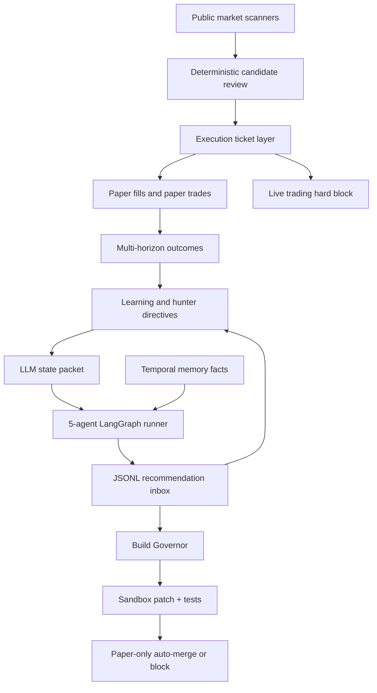

# Cost-Controlled AI Swarm

This is the mini-first agent layer around the deterministic radar. The radar keeps scanning and paper-trading every minute. LLM agents read compact state and memory, then write bounded JSONL recommendations that the deterministic system ingests as tasks, experiments, and hunter directives.

Live trading remains disabled. Agents cannot place orders, enable credentials, install dependencies, or rewrite code outside the Build Governor.



## Agents

- Market Scout: hunts new markets, assets, data gaps, and obscure venues.
- Cross-Market Researcher: reasons over event, asset, macro, crypto, equity, commodity, and prediction-market links.
- Red-Team Agent: diagnoses losing or decaying signal families.
- Execution Route Hunter: studies how conditional opportunities could become tradable through legal routes, permissions, fees, borrow, APIs, or brokers.
- Build Planner: turns evidence into implementation tasks, signal variants, or Build-Governor-gated paper-only code changes.

## Model And Cost Policy

All calls go through `src/cost_router.py`.

- Default: no paid model call unless `RADAR_USE_LITELLM=1` and provider credentials are configured.
- OpenAI GPT-5.x tiers use the native Responses API where practical.
- Fast tier: `openai/gpt-5.4-mini`, used by default for all five agents.
- Standard tier: `openai/gpt-5.4`, used for earned escalation after concrete evidence, valid targets, or broad route/market pressure.
- Codex tier: `openai/gpt-5.3-codex`, available for code-patch workloads if the API project supports it.
- Frontier tier: `openai/gpt-5.5`, reasoning `high`, reserved for rare explicitly escalated root-cause, promotion/revert, or code-evolution decisions.
- Per-agent and global daily budgets are read from `config/llm_config.example.yaml`.
- Budget checks run before model calls; over-budget agents fall back to no-cost recommendations.
- Cost logs include model API, reasoning effort, verbosity, operation, structured-output mode, and frontier escalation reason.

## Code Evolution

`propose_code_change` recommendations are handled by the Build Governor:

- Allowed: public-data adapters, parser fixes, scanner expansion, paper-only variants, reports, prompt/state-packet improvements, quality scoring, read-only route intelligence, tests, and fixtures.
- Blocked: live trading, credentials, broker writes, real notional changes, dependency installs, startup/system changes, destructive data actions, and live route enablement.
- Safe patches are applied in a temporary workspace first, then tested before they can auto-merge into the paper runner code.
- Every proposal is tracked in `runs/evolution_report.md`, `runs/evolution_report.json`, and `runs/evolution_ledger.jsonl`.

## Memory

The current memory layer stores temporal facts in SQLite and exports a Graphiti-compatible JSONL file:

- `runs/memory_facts_latest.md`
- `runs/graphiti_memory_export.jsonl`

Facts currently cover performance summaries, signal decay, hunter directives, and venue reachability. A real Graphiti service can be attached later without changing the radar's safety model.

## Learning

Learning is deterministic and paper-only:

- Closed paper trades update signal-family score adjustments.
- Open trades generate 5m, 15m, 1h, 4h, and 1d outcome snapshots when enough time has elapsed.
- Contextual buckets track venue, trade type, direction, region, asset class, liquidity, spread, and feasibility.
- The hunter allocates attention across exploit, explore, and diagnose based on observed outcomes.

## Market Coverage

Current adapters:

- OKX perpetual swap basis and funding scanner.
- US-listed global ETF and ADR proxy scanner.
- Public Polymarket and Kalshi prediction-market scanner.
- Public crypto venue reachability scanner for Coinbase, OKX, Kraken, Bybit, and Binance US.

All new markets enter paper mode first. Conditional or route-unknown markets can be paper-tested, but are live-blocked.

## Key Commands

```powershell
python .\src\llm_swarm_runner.py --force
python .\src\prediction_market_scanner.py --top 25
python .\src\crypto_venue_scanner.py
python .\src\radar_loop.py --iterations 1 --hold-minutes 0 --scan-universe 80 --review-top 30
.\scripts\status_radar.ps1
```

## Safety Gates

- `allow_live_trading` must be true before live trading could even be considered.
- The current code intentionally exits if live trading is enabled.
- `risk.max_live_notional_usd` defaults to 0.
- No credentialed live route adapter exists in this MVP.
- Agents only propose. Deterministic code gates every recommendation.
